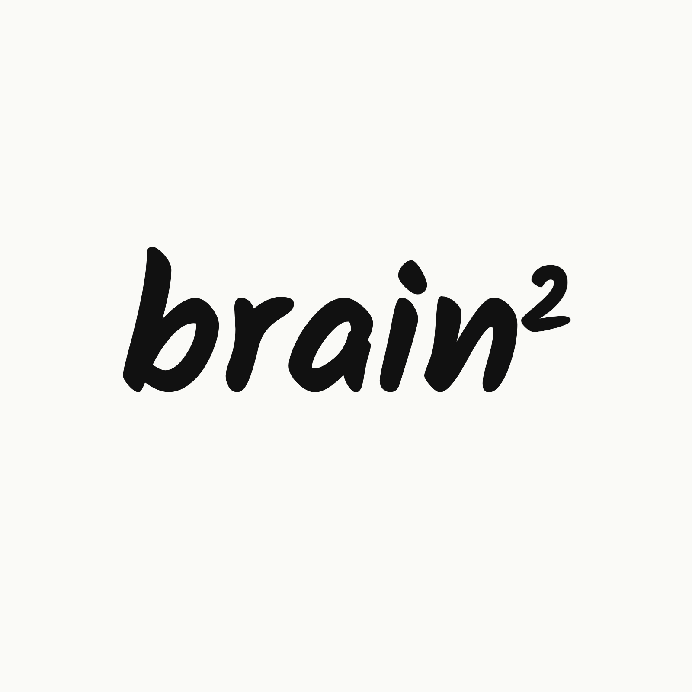

<p align="center">
  
</p>

<h1 align="center">brain² (BrainSquared)</h1>

<p align="center">One interface for every app you use. Powered by AI that knows your context.</p>

<p align="center">
  <a href="https://pypi.org/project/brainsquared/"></a>
  
  
</p>

---

Most of your day is spent context-switching. You check Gmail, switch to Slack, open Notion for a task, look at your calendar, review a GitHub PR — and repeat. Each app only knows its own slice of your life.

brain² connects all of them. It builds a living knowledge base from your tools — using LLMs to maintain and update it like a wiki, not a data dump — and gives you one place to read, act, and stay on top of everything. Need to reply to an email? See what's on your calendar? Get reminded about a Slack thread you never answered? Close out an issue? brain² surfaces it all, lets you act on it, and learns from it.

Everything runs locally. No cloud middleman. Your data stays yours.

---

## How it works

```
Browser UI  ──►  brain² Server  ──►  Claude Code / Codex CLI
                                              │
                                     Local Knowledge Base (Obsidian vault)
                                              │
                        Gmail · Calendar · GitHub · Slack · Notion · Linear · ...
```

brain² treats your tools as sources of truth and your local vault as a continuously updated knowledge base. When you connect a new integration, the AI reads your existing notes and makes surgical edits — updating what's relevant, adding only what has no home yet. Nothing gets overwritten wholesale.

Every day you get a unified view of what needs your attention. You act on it. What you finish disappears tomorrow. What you don't comes back.

---

## Quickstart

**Prerequisites:** [Claude Code](https://claude.ai/code) (or Codex) installed and authenticated on your machine.

**1. Install**

```bash
pip install brainsquared
```

**2. Create your vault**

If you're starting fresh:
```bash
brain init --vault ~/my-vault
```

If you want to seed it from your existing tools first:
```bash
brain seed --vault ~/my-vault \
           --from-obsidian ~/path/to/existing-vault \
           --from-gmail \
           --from-calendar \
           --from-notion
```

**3. Start**

```bash
brain start --vault ~/my-vault
```

Opens `http://localhost:3000` in your browser.

**4. Connect your tools**

Go to the **Integrations** tab in the UI. Connect Gmail, GitHub, Notion, Slack, or any other tool — paste an API key or go through OAuth. No config files needed.

**5. Generate your daily note**

Go to the **Tasks** tab and click **Generate Daily**. brain² pulls your tasks, events, emails, and open PRs into one view. Tick things off as you go.

---

## Integrations

We're building connections to every app people use daily. Current integrations include Gmail, Google Calendar, GitHub, Notion, Slack, and Linear — with many more on the way.

Connect them through the UI. No config files, no manual credential wrangling. brain² starts pulling context immediately and keeps your knowledge base up to date as things change.

---

## All commands

```bash
brain seed    --vault PATH  [--from-obsidian PATH] [--from-notion] [--from-gmail] [--from-calendar] [--dry-run]
brain init    --vault PATH  [--agent claude-code|codex]
brain start   --vault PATH  [--agent claude-code|codex] [--port N] [--no-open]
brain daily   --vault PATH  [--force]
brain status  --vault PATH
```

---

## Development

```bash
git clone https://github.com/Sushanti99/BrainSquared
cd BrainSquared
python3 -m venv .venv && source .venv/bin/activate
pip install -e '.[test]'
pytest -q
```

---

## Roadmap

- [ ] More integrations — Jira, Figma, Zoom, iMessage, and more
- [ ] `brain setup` — guided OAuth so each user owns their own Google credentials
- [ ] Action layer — reply to emails, send Slack messages, create tasks, directly from brain²
- [ ] VPS deployment with remote vault sync
- [ ] Mobile access via Tailscale
- [ ] Scheduled background updates
